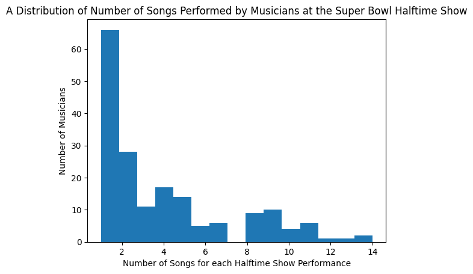
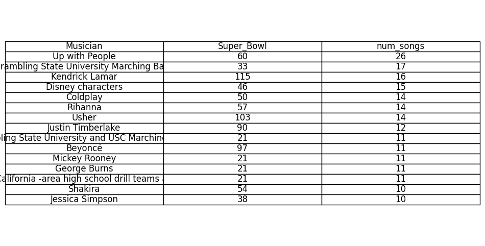

# Introduction to Data Science Project Report

---

## **Project Title**: 🏈🎙Superbowl Halftime Show Performances

**Name**: Jade Ana-Maria Menezes-Fernandes

**Date**: 25/02/2025

**Organization/Institution**: Click Start Peckham Digital Accelerator Zone (DAZ)/ Creative Computing Institute at University of the Arts London

---

## **Introduction**

Two weeks ago, Kendrick Lamar headlined the Apple Music Super Bowl LIX Halftime show which took place at the Caesars Superdrome in New Orleans, Louisiana. It is the most watched Super Bowl halftime show, with a [TV audience of more than 133.5 million viewers](https://en.wikipedia.org/wiki/Super_Bowl_LIX_halftime_show).

The Super Bowl halftime show has large cultural influence, can generate viral moments and set trends that spark discussions.

My personal favourite is the Super Bowl LVI halftime show starring Dr. Dre, Snoop Dogg, Eminem, Mary J. Blige and Kendrick Lamar. It is the first Super Bowl halftime show to win the [Primetime Emmy Award for Outstanding Variety Special (Live)](https://en.wikipedia.org/wiki/Super_Bowl_LVI_halftime_show). 

It also happens to be most viewed Super Bowl halftime show on YouTube with more than 322 million views on the official *NFL* YouTube channel alone... and I’m *pretty sure* I made a *huge* contribution, considering I watched it at least 20 times on repeat.😆 

In this project we will be exploring data from Super Bowl halftime performances to figure out who are the most prolific performers to grace the stage.

---

## **Data Collection**

### Data Source

The data for this project was sourced from the [List of Super Bowl Halftime Shows](https://en.wikipedia.org/wiki/List_of_Super_Bowl_halftime_shows) page on Wikipedia. This publicly available resource compiles detailed information about Super Bowl halftime shows. 

Specifically, the tables provide information from the 1960s up until the most recent performances.

Since this dataset is freely available online and updated periodically by the Wikipedia community, it serves as a reliable starting point for analyzing trends in halftime shows. 

### Data Collection Method

 Since the data on this page is structured in tables and lists, web scraping was the most efficient method for extracting relevant details such as:

- **Halftime show performers** for each year (such as headliners and special guests, where available)
- **Super Bowl year**
- **Setlist**

I used libraries such as **`BeautifulSoup`** and **`requests`** to parse the HTML content of the page, locate all the `wikitable` tables 

---

## **Representation and Bias Reflection**

### **Biases in the Dataset**

- **Selection Bias** :
    
    Wikipedia is a curated resource. There could be selection bias in the inclusion of performances. This results in underrepresentation of some halftime shows, particularly from earlier years or those with less widely recognized performers/ special guests.
    
- **Sampling Bias** :
    
    The data predominantly reflects performances that were heavily covered in mainstream media. Therefore, the dataset may disproportionately represent halftime shows in the internet age which are more likely to have complete and accessible data. Much older performances might lack detailed metrics such as TV ratings, YouTube views or even detailed setlists.
    
- **Artist and Genre Bias :**
    
    The musical genre of halftime shows in recent years have predominantly been pop, hip-hop and rock, often featuring big-name artists. Performances of these genres are overrepresented and other types of musical styles are underrepresented
    

### Consequences of Bias

- **Skewed Insights** :
    
    Conclusions about the most popular musical genres or performers might be biased toward high-profile acts and fail to reflect the diversity of the performances over the years.
    
- **Limited Generalizability** :
    
    If data from earlier shows is sparse or absent, the model or analysis could be skewed towards recent, better- documented viewership.This would limit the generalizability of any trends or conclusions to the broader history of the Super Bowl halftime show
    
- **Other consequences** :
    
    More emphasis on certain genres potentially overlooking newer or non-Western musical trends that may better reflect evolving tastes.
    

### Mitigation Strategies

- **Handling Missing Data :**
    
    Given the inconsistencies in performer types (eg, band vs solo, headliners and supporting acts) Not all performances may have a clear setlist or song count available. Incomplete data may appear in the dataset as empty or `NaN` values.
    
    - **Omitting incomplete rows**
    determining the most prolific performers or analyzing song count, you can **remove rows** where critical data (like performer names or song counts) is missing. For instance, if the **"num_songs"** column is empty for a particular performance, removing that row will ensure your analysis focuses only on fully complete data.

        

---

## **Methodology**

- **Web scraping**
    
    As discussed before I used `BeautifulSoup` and `requests` to get data from Wikipedia. After scraping I had to do some preprocessing. Such as removing whitespace from “Super Bowl” to rename to “Super_Bowl”
    
    As I was converting Roman numerals to numbers in that column I need to make sure that everything in that row was Roman numerals. 
    
- **Data cleaning**
    
    I used pandas librarys for cleaning, dropped colomns not needed for analysis, removed duplicates.
    
    I then defined a function to convert roman numerals to integers using a function i found on stack overflow i did check if the function worked and then applied to column.
    
    Next, I inspected the missing data and printed them. Upon inspection I made the decision to keep the rows with missing data. And concatenate the performers, headliners and specials guests into a new musicians column
    
    As I was going to look at individual musicians i need to split up each row for each musician. After this I defined a function to apply to musicians to create a new column `num_songs`which was a count of the number of times a musicians name was mentioned in the setlist.
    
    I defined a second function because the first didn't account for headliners who’s songs were the whole setlist and their name wasn't explicitly mentioned in `Setlist` column. Then initial clean was saved
    
    Following that, I filtered `num_songs == 0` to find performers who did not have songs (i.e. Serena Williams) and saved this list of individuals as a separate data frame before removing them from original.
    
    Finally I sorted the data frame by Superbowl number from latest to oldest and renamed `Musician(s)` column to `Musician`.
    The structure is shown below:

| Column | Description | Data type |
| --- | --- | --- |
| `'Super_Bowl'` | The Super Bowl number (e.g., 59 for Super Bowl LIX). | Categorical Ordinal |
| `'Musician'` | The name of the musical act that performed during the halftime show. | Categorical Nominal |
| `'num_songs'` | The number of songs performed by the musician or group during the halftime show. | Numerical Discrete |

    
- **Data analysis**
    
    Counted the most halftime show appearances by each musician
    
    Displayed a ranked list to simply show musician with most appearances
    
    Created a histogram to visualise how many songs a musician usually performs.
    
    Used [geeks for geeks](https://www.geeksforgeeks.org/bubble-chart-using-plotly-in-python/) to help create bubble chart to visualise musicians by the number of songs performed
    

---

## **Results**

I have included 3 notebooks to show my work.

- [Webscraping data](1_Webscraping_data.ipynb)
- [Cleaning data](2_Cleaning_data.ipynb)
- [Analyzing data](3_Analyzing_data.ipynb)

Through my analysis I was able answer the following questions:

Who has the most halftime show appearances? see most_appearances.png

How many songs are usually performed by each musician in a set? see songs_per_musician_per_show.png

Who has performed the most number of songs? see musician_most_songs.png & num_songs_performed.html

Open[Fig4](num_songs_performed.html) in web browser

you can also find these figures in [Analyzing data notebook](analyzing_data.ipynb)

---

## **Reflection**

- **Challenges Encountered and Solutions**:
    
    I faced many challenges during the project and I’m so grateful for what I’ve learned from them. Especially in terms of cleaning data. Here is a summary of main challenges below 
    
    | Challenge encountered | Solution |
    | --- | --- |
    | 1. When web scraping only the first table in the wiki page was being read into a data frame | with help from my tutor I used list comprehension to process each table and then combine all the separate data frames using `pd.concat()` |
    | 2. converting to roman numerals | researched useful functions used an example on [Stackoverflow](https://stackoverflow.com/questions/61719161/roman-to-integer-python) and tested it out |
    | 3. after inspecting not all rows were in roman numerals  | use `str.replace()` in Super_Bowl column to make sure all rows are numerals before converting to integers |
    | 4. After removing”show” using `str.replace().` I had lost rows from data frame | I edited my code to include an if statement to ensure that the replacement only applied to rows that actually contain the substring. |
    | 5. Whitespace | Renamed column `Super_Bowl` |
    | 6. after inspecting missing data and merging columns i noticed that some artists were missing. the 2020 headliner column had Shakira but not Jennifer Lopez so i had to go back to inspecting the HTML structure of the table on the wiki page seems there was nested `<a>`tags. | I realised some performers were not separated by commas so went back to inspecting HTML structure there are list elements within a cell. Had to change how I processed table, considering `<li>` and`<a>` tags |
    | 7. figuring how i was going to create a column for number of songs i tried to use `values_count` then realised cant use it for strings. | so i tested my own function using `count` and applied to df. after filtering data for `num_songs ==0` and saving df i found a lot of errors while inspecting. went back to `addstrip()` to my function definition
     |
    | Headliner(s) giving 0 in num_songs col. made function to change this. This function didnt work | Edited function from `if row['Headliner(s)'] == row['Musician(s)']`
    to `if row['Musician(s)'] in row['Headliner(s)']`. and then still had to change function a few times again to get it right.
     |
- **What Went Well**:
    
    I identified before I started cleaning what questions I wanted to answer. So I had a clear understanding of what i wanted my data frame to look like in my head of how I was able to reach from raw data to cleaned file that was useful for  analysing those specific questions. I was able to successfully create a histogram plot and a bubble chart to visualise data.
    

---

## **Conclusion**

- **Summary of Key Findings**: Al Hirt and the non profit organisation Up with People had the most appearances on superbowl halftime show. Most musicians perform 1-4 songs in a performance. Non-band musicians who performed the most songs include the likes of Kendrick Lamar, Usher, Rihanna and Coldplay.
- **Future Work**:
    
    Next steps for the project I would have loved to have taken a closer look at Superbowl halftime performances from the past 10 years and analyse data around YouTube views demonstrating my data gathering skills using APIs
    

---

